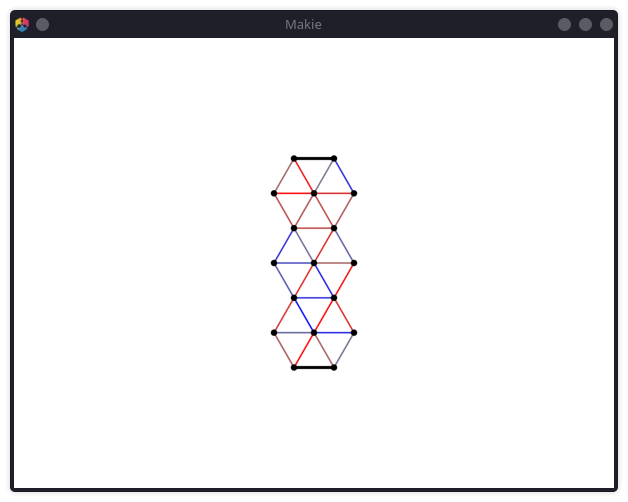

# Guide

## Installation & Setup

As it is still in development, this package is not available in the General
Registry yet. You can still install the latest version using the Julia package
manager with

```julia
julia> # type ] to open package manager

pkg> add https://github.com/Alexander-Reimer/Simulation-of-MNNs
```

This should install the MNN package and all dependencies automatically.

### NixOS

When using NixOS, activating the development shell is necessary to make GLMakie
and consequently the visualization of MNNs / graphs / ... possible:

```bash
cd /path/to/this/project
nix-shell .
```

This will load the configuration in default.nix.

## Usage Example -- Simulating & Optimizing a Deformation Behaviour

**Load MNN library:**

```@repl usageA
using MNN
```

**Create a new MNN:**

```@setup usageA
using Random
Random.seed!(1)
```

```@repl usageA
net = Network(5, 4) # 5 columns, 4 rows
```

**Create a deformation behaviour using a GUI:**

```julia
b = get_user_behaviour(net)
```



1. Left-click a neuron in first or last column and then release the mouse button to select it
2. If you move your mouse, you should see a blue (force vector applied to
   neuron) or red (goal position) arrow. Click again to save / select the current arrow for this neuron.

**Or create a random deformation behaviour:**

```@repl usageA
b = create_deformation_behaviours(net, 1)[1]
```

**Show MNN and created behaviour:**

```@repl usageA
vis = Visualizer(net, behaviour=b)
MNN.GLMakie.save("usageA_Visualization.svg", vis.fig, backend=MNN.CairoMakie) # hide
```


**Simulate the behaviour:**

Keep the window of the last step open, then execute

```@setup usageA
visB = vis;
vis = nothing;
```

```@repl usageA
simulate!(net, SecondOrderDiff(500), b, vis=vis)
reset!(net, vis = visB); # hide
MNN.GLMakie.record(visB.fig, "usageA_simulationBefore.mp4", 1:70) do i # hide
    simulate!(net, MNN.SecondOrderDiff(3), b, vis = visB) # hide
end; # hide
```


You should now see the mass points ("neurons") of the network settling into new
stable positions according to the random spring constants set when you created
the MNN and the forces randomly generated or set by you. This may take a while
the first time because of precompilation, but should then be very fast in the
same Julia session.

It should also be obvious that the neurons in the last column are far away from
the set goal (except if you got really, really, really lucky).

**Creating a trainer:**

To optimize the spring constants, we need a `Trainer` object:

```@repl usageA
t = Trainer([b], SecondOrderDiff(500), PPS())
```

**Training:**

Now we train for 500 Epochs:

```@repl usageA
train!(net, 500, t)
```

Ideally, the base loss (the best loss so far) will decrease significantly.

If it hasn't, try executing the previous command again to train the MNN more.

If that still doesn't get satisfactory results, then maybe the goals and/or
forces you set using the GUI were too large.

**Testing:**

Now check if the MNN fits the given shape morphing behaviour better:

```@repl usageA
vis = Visualizer(net, behaviour=b); # update visualization of spring constants
visB = vis # hide
vis = nothing # hide
reset!(net, vis=vis) # reset neuron positions
simulate!(net, SecondOrderDiff(500), b, vis=vis)
reset!(net, vis = visB); # hide
MNN.GLMakie.record(visB.fig, "usageA_simulationAfter.mp4", 1:70) do i # hide
    simulate!(net, MNN.SecondOrderDiff(3), b, vis = visB) # hide
end; # hide
```


As you can (hopefully) see, the end positions of the neurons now fit much
better. The values of the spring constants probably also changed significantly.
You can see this by looking at the colors of the springs (lines between
neurons): Red means positive spring constant and blue means negative constant.
